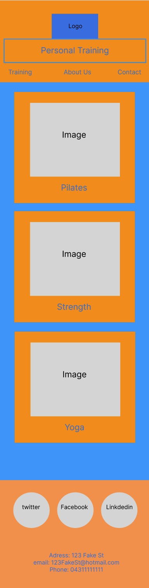

# A website built from scratch

- html
- css
- wireframes
- git
- markdown# t1w2sat

## HTML

We started creating the skeleton (! + Enter in VSCode), then we created the header, linked the CSS and the other two big containers, main and fotter.

Header, contains a logo, a heading anda navigation

```html
<!DOCTYPE html>
<html lang="en">
<head>
    <meta charset="UTF-8">
    <meta http-equiv="X-UA-Compatible" content="IE=edge">
    <meta name="viewport" content="width=device-width, initial-scale=1.0">
    <link rel="stylesheet" href="./css/style.css">
    <title>Personal Training Website</title>
</head>
<body>
    <header>
        <div class="logo">
         <p>My logo</p>
        </div>
        <h1>Personal Training</h1>
        <nav class="nav-items">
            <a href="">Training</a>
            <a href="">About Us</a>
            <a href="">Contact</a>
        </nav>

    </header>
```
## CSS

Defined primary and secondary colors, add them to the bakgrounds and text colors.

Flex box for the header to align the three elements inside centered and vertically.

```css

header{
    background-color: #ff9900;
    display: flex;
    flex-direction: column;
    align-items: center;
}
```

## Wireframes



